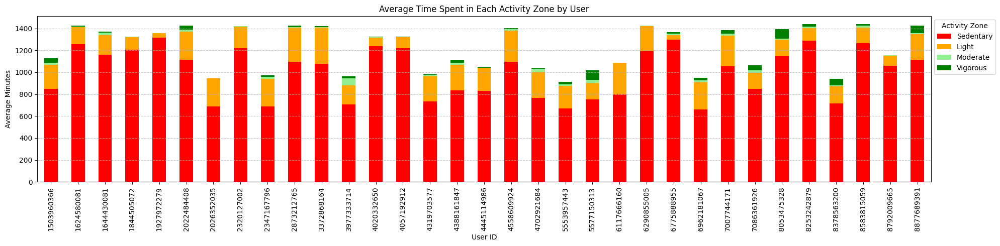

# healthcareanalytics101

1. This Repository contains all code and reports for all my projects related to healthcare data analytics
2. The projects in this repository are -
    1. [Bellabeat Case Study](fitnesstrends/README.md) -
    A case study that studies trends in usage of smart device to identify growth opportunities and provide recommendations for marketing, for a company called Bellabeat. An analysis example -

    
    **Figure:** This bar graph shows the activity patterns of users. The X-axis contains user id, and the Y-axis represents average time (minutes) during the 31 days of device usage.