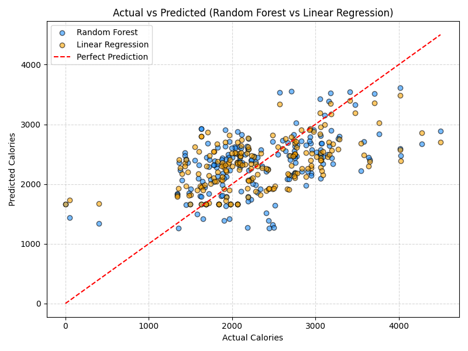

# healthcareanalytics101

This Repository contains all code and reports for all my projects related to Healthcare Data Analytics.

The projects in this repository are -
    
1. [Bellabeat Case Study](fitnesstrends/README.md) - 
    A case study that studies trends in usage of smart device to identify growth opportunities and provide recommendations for marketing, for a company called Bellabeat. An analysis example -

    
    
    **Figure:** This bar graph shows the activity patterns of users. The X-axis contains user id, and the Y-axis represents average time (minutes) during the 31 days of device usage.

2. [Predicting Calories Burned Using Random Forest Regression](ML_algorithms/Random_Forest/README.md) -
    This project investigates the effectiveness of machine learning models in predicting **calories burned** based on **daily step count**. The primary goal is to develop and evaluate a **Random Forest Regressor**, compare it with a **Linear Regression** model, and assess both models using regression metrics and visualizations.

     
   
   **Figure:** This scatter plot visualizes the model's predictions compared to the actual calorie values. Each point represents one observation. Points along the *diagonal line* indicate perfect predictions.

