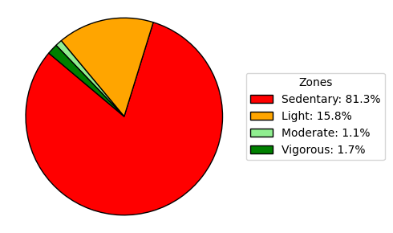

# healthcareanalytics101

1. To create a virtual environment
```
python3 -m venv venv --prompt="kaggle"
```

2. To activate a virtual environment
```
source venv/bin/activate
```

# Bellabeat Case Study

## Aim
Identify potential opportunities for growth and provide recommendations for Bellabeat's marketing strategy based on trends in usage of smart devices.

## Key Questions
1. What are the current trends in smart device usage?
2. How could these trends apply to Bellabeat customers?
3. How could these trends help influence the Bellabeat marketing strategy?

## Data Source
Kaggle data set [FitBit Fitness Tracker Data](https://www.kaggle.com/datasets/arashnic/fitbit) has been used for this case study.

- This dataset generated by respondents to a distributed survey via Amazon Mechanical Turk.

- 30 eligible Fitbit users consented to the submission of personal tracker data for 31 days, such as their minute-level physical activity, heart rate, and sleep monitoring.

## Data Analysis
- Data analysis and visualizations were performed in Python using Jupyter Notebooks within Visual Studio Code.
- Datasets used - dailyIntensities_merged, dailySteps_merged, dailyCalories_merged (to be described more...)
- 

## Report
1. Trends in device usage :

**Figure 1:** This bar graph shows the activity patterns of users. The X-axis contains user id, and the Y-axis represents average time (minutes) during the 31 days of device usage.


**Figure 2:** Pie chart illustrating the trends time spent during 31 days of the smart device usage

## Recommendations
1. 

## References
1. [Bellabeat Website](https://bellabeat.com/)
2. [How Many Steps a Day Is Considered Active?](https://www.medicinenet.com/how_many_steps_a_day_is_considered_active/article.htm)
3. [Number of steps per day more important than step intensity](https://www.nih.gov/news-events/nih-research-matters/number-steps-day-more-important-step-intensity)
4. [Daily steps and all-cause mortality](https://www.thelancet.com/journals/lanpub/article/PIIS2468-2667(21)00302-9/fulltext#seccestitle140)
5. [Adult Activity: An Overview](https://www.cdc.gov/physical-activity-basics/guidelines/adults.html)